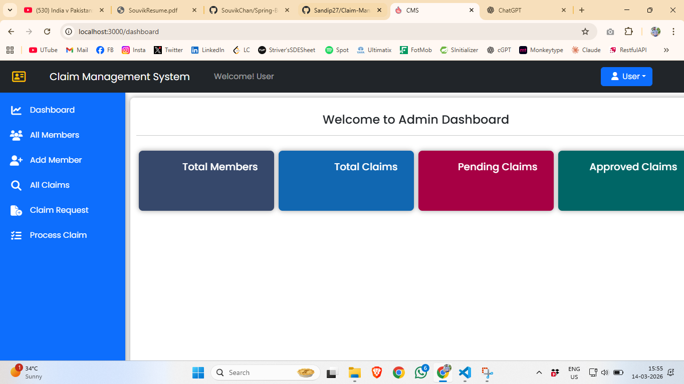
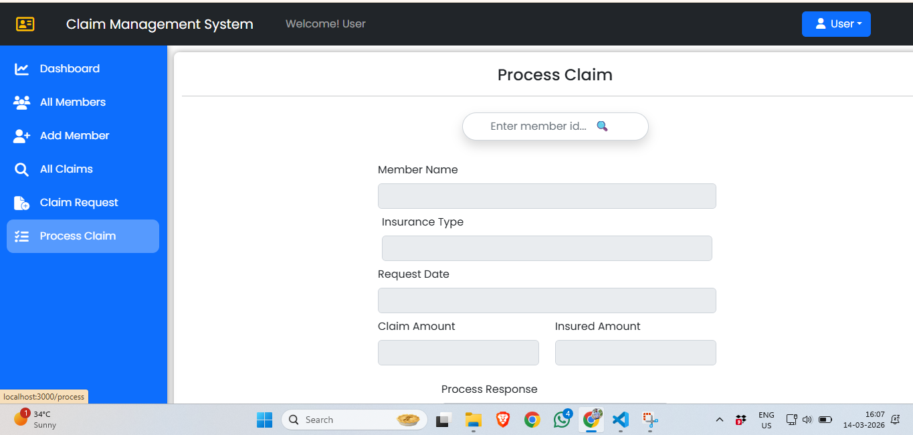

# 🚀 YeInsurify - Insurance Management System (IMS)

## 📌 Project Overview
**YeInsurify** is a full-stack **Insurance Management System** designed to simulate real-time insurance policy operations.  
The application provides an efficient platform for managing **policies, customers, and transactions** through a modern web interface and a powerful backend.

---

## 🛠️ Tech Stack

### 💻 Frontend
- ⚛️ React.js  
- 🎨 Responsive UI Design  
- 🔗 REST API Integration  

### ⚙️ Backend
- ☕ Java  
- 🌱 Spring Boot  
- 🧩 Spring Framework  
- 🔗 RESTful APIs  

### 🗄️ Database
- 🐘 PostgreSQL  

### 🧠 ORM & Data Handling
- Hibernate  
- JPA  
- JDBC  

---

## ✨ Features

- 📑 **Policy Management** – Create, update, and manage insurance policies.  
- 👥 **Customer Management** – Handle customer details efficiently.  
- 💳 **Transaction Tracking** – Manage insurance-related transactions.  
- 📊 **Multi-Dimensional Tables (MDT)** – Efficiently manage policy, customer, and transaction data.  
- 📱 **Responsive UI** – Smooth and interactive user experience using React.js.  
- 🔄 **RESTful API Architecture** – Seamless communication between frontend and backend.

---

## 🏗️ System Architecture

The system follows a **Layered Architecture**:

#Controller Layer → Service Layer → Repository Layer → Database

- **Controller Layer** – Handles incoming API requests  
- **Service Layer** – Business logic and processing  
- **Repository Layer** – Database operations using JPA/Hibernate  
- **Database Layer** – Persistent storage using PostgreSQL  

---

## 🔑 Key Java Concepts Used

- 📦 Java Collections Framework  
- ⚠️ Exception Handling  
- 🧱 Layered Architecture  
- 🔧 Service-based Design Pattern  
- 📡 RESTful Web Services  

These concepts improve the **maintainability, scalability, and efficiency** of the system.

---

## 📂 Project Structure

yeInsurify-IMS
│
├── frontend (React.js)
│ ├── components
│ ├── pages
│ └── services
│
├── backend (Spring Boot)
│ ├── controller
│ ├── service
│ ├── repository
│ └── model
│
└── database
└── PostgreSQL schema

[Insurance Dashboard](Screenshot 2026-03-14 160708.png)

